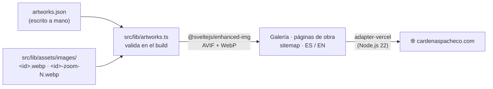

# Carmen Cárdenas Pacheco — Portfolio

**El portfolio web de la artista Carmen Cárdenas Pacheco: una galería online que muestra obra original (óleo, acrílico, grafito…) en alta resolución sin que la web pese ni tarde.**


### 🔗 Ver en vivo → **[cardenaspacheco.com](https://cardenaspacheco.com)**

---

## El problema

Un artista necesita enseñar su obra tal cual es: color fiel y detalle al máximo. Pero las fotos de cuadros pesan **5 MB o más** cada una, y una galería llena de ellas se vuelve lenta, mala para SEO y frustrante en móvil. Este proyecto resuelve la tensión entre **fidelidad visual** y **rendimiento**: sirve decenas de obras en alta resolución manteniendo una puntuación **Lighthouse 95+**, en español e inglés para llegar a más público.

## Cómo funciona

El original pesado nunca llega al navegador. Un único módulo (`src/lib/artworks.ts`) une los datos de cada obra, escritos a mano, con sus imágenes, y el build genera los tamaños responsive.



**Decisiones técnicas y su porqué:**

- **Un solo archivo de datos, escrito a mano** (`src/lib/artworks.json`): título, año, etiquetas, medidas y si está vendida. Ningún script lo escribe. El orden del archivo es el orden de la galería.
- **Imágenes por convención de nombre** (`src/lib/assets/images/`): `<id>.webp` es la imagen principal y `<id>-zoom-N.webp` los detalles. Hay una sola copia de cada imagen en el repositorio.
- **Validación en el build**: una obra sin imagen principal, una imagen sin obra, una etiqueta desconocida o un campo mal formado paran el build con un mensaje que nombra la obra.
- **Imágenes responsive con `@sveltejs/enhanced-img` + carga diferida**: el build genera AVIF y WebP en varios anchos, y cada tarjeta sirve el tamaño justo para el dispositivo.
- **Multiidioma con `svelte-i18n`** (ES por defecto, EN): diccionarios en `src/lib/locales/`, pensado también para SEO internacional.
- **`sitemap.xml` generado** por la ruta `src/routes/sitemap.xml` a partir del módulo de obras: cada página `/artwork/[id]` queda indexable sin mantenimiento manual.
- **Cabeceras de seguridad y caché** (`vercel.json`): HSTS, anti-clickjacking y `Cache-Control` inmutable de un año para assets e imágenes.
- **`bigger-picture`** como visor/lightbox para ver cada obra ampliada sin librerías pesadas.

## Stack

| Capa | Tecnología |
|------|------------|
| Framework | Svelte 5 + SvelteKit |
| Lenguaje | TypeScript |
| Estilos | Tailwind CSS 4 · sin fuentes web (tipografía del sistema) |
| Imágenes | @sveltejs/enhanced-img · bigger-picture |
| i18n | svelte-i18n (ES / EN) |
| Iconos | lucide-svelte |
| Analítica | Vercel Analytics + Speed Insights |
| Despliegue | Vercel (`@sveltejs/adapter-vercel`, runtime Node.js 22) |

## En números

> - **95+** en rendimiento (Lighthouse)
> - **44** obras en la galería
> - **5 MB+** por foto original → **AVIF / WebP** en varios anchos
> - **2** idiomas (español · inglés)
> - **1** archivo de datos escrito a mano, validado en cada build

## Ejecutar en local

```bash
npm install

npm run dev        # servidor de desarrollo (Vite)
npm run build      # build de producción
npm run preview    # previsualizar el build
```

**Añadir una obra:** copia su foto a `src/lib/assets/images/<id>.webp` (y los detalles como `<id>-zoom-1.webp`), y añade su entrada a `src/lib/artworks.json`. El build comprueba que las dos cosas encajan.

**Calidad de código:**

```bash
npm run check     # type-check con svelte-check
npm run lint      # ESLint
npm run format    # Prettier
npm test          # Playwright contra el build de producción
BASE_URL=https://<preview>.vercel.app npm test  # contra un despliegue de Vercel
```
